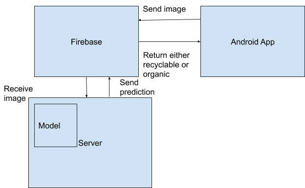

# Waste-Classification-App
An application which can classify images of objects into Organic and Recyclable

## Abstract
In today's world, waste has become a significant burden on society. There has been a substantial rise in solid waste generation in the past few decades. This rise is mainly due to the rapid urbanization of the country. Segregation or classification of waste is important part of waste management. This paper provides a solution that can be used by ordinary people to reduce the burden on waste classification workers by classifying the waste themselves using a CNN model running on a server and an android app. Our method classifies the waste with an accuracy of 89.50\%.

## Model

### Dataset
Dataset can be found [here](https://www.kaggle.com/techsash/waste-classification-data "Dataset reference"). The dataset has the following structure:
```bash
├── DATASET/
│   ├── TEST/
│   │   ├── O/
│   │   └── R/
│   ├── TRAIN/
│   │   ├── O/
│   │   └── R/
└── 
```

### Getting started
* Download the dataset
* Pre-processing the data present in the dataset
* Training a neural network model on the pre-processed data and saving the best model
* Loading the saved model and predicting results
* Making use of the [```API```](api.py) to classify images sent from the android application
* For detailed explanation kindly checkout [```waste-classification.ipynb```](waste-classification.ipynb "iPython notebook"). The notebook contains data pre-processing, training a neural network and testing it using some more images present in the test dataset.

### Model Architecture


## Android Application
An application to classify an object into organic or recyclable.

### Firebase
* Real-time database: Object attributes are pushed to the database and the image category is fetched from the database after image classification has taken place.
* Storage: The object image is stored in a bucket on Firebase Storage bucket. This image is used by the API for its classification.

### Architecture of the application


## Using the application
1. Start the [```python server```](Model/api.py).
2. Run the android application.
3. Select an image in the app either by capturing an image using camera or picking an image from the local internal storage.
4. Upload the image to the cloud storage. Wait for a few seconds till the result is delivered.

## Contributor

Aneek Hait 
https://www.linkedin.com/in/aneekhait/
